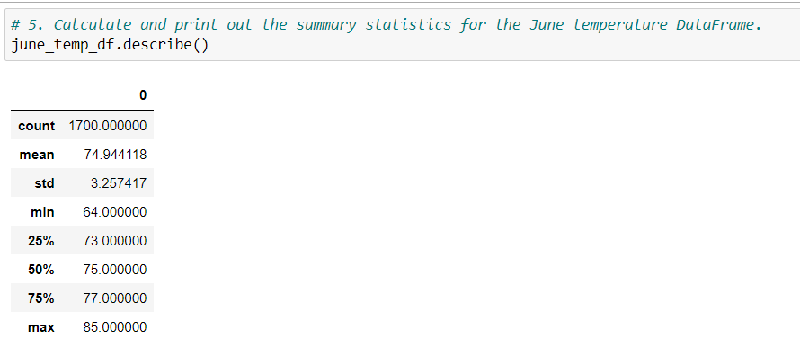
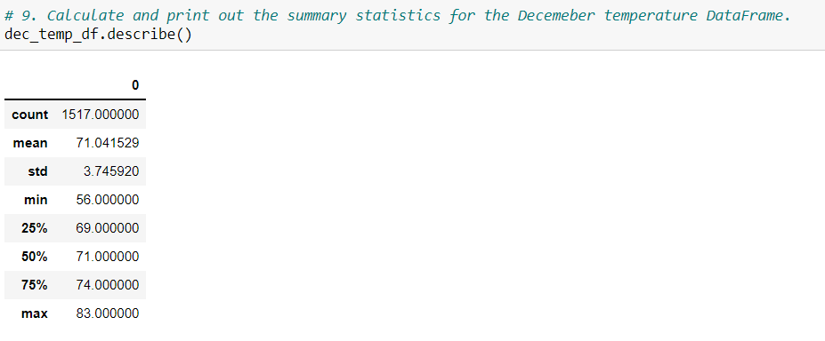
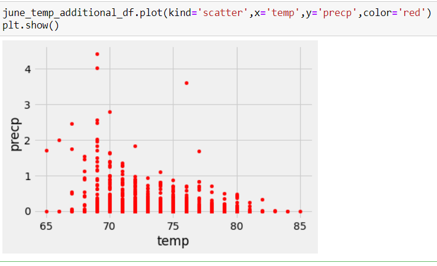
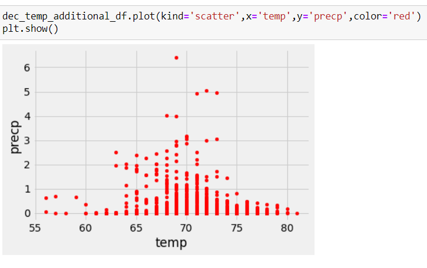

# SurfsUp_Challenge
Temperature analysis using Python, Pandas functions and methods, and SQLAlchemy

## Overview of the statistical analysis:

The purpose of the analysis is to determine the temperature data for the months of June and December to determine temperature trends. This information is leveraged to determine if the surf and ice cream shops business is sustainable year-round in Oahu and possibly other islands in the future.

## Results:

The June weather data is collected from 1700 samples  between 2010-06-01 and 2017-06-30 for various stations.
The mean temperature is 74.944118, median temperature 75.000000,minumum 64.00 degrees and maximum recorded temperaure as 85.000000

The December weather data is collected from 1517 samples  between 2010-12-01 and 2016-12-31 for various stations.
The mean temperature is 71.041529, meadian temperature 71.000000, minimum 56.00 degrees and maximum recorded temperaure as 83.000000

## Summary:

Comparing the June and December weather data, it can be inferred that there is not much significant difference in average temperaures for both the months.
The minimum temperaure for December is noted as 56.000000  and for june  64.000000.

Additional analysis is performed to determine precipitaion data vs temperature for the months of June and December and analyzed using scatter plots.

It can be noticed from the plot  that the mean precipiation for June is around .13 with some outlier precipation of 4.43 when the temperature is 69 degrees and 3.5 around 76 degrees.

For December the mean precipiation is around .21 with some outlier touching 6.1 when the tempertaure is around 69degrees and some precipiatation values closer to 5 when the temperature range is 70-75 degrees.

We need to explore further details like the station locations, precipitation details by locations,outliers to determine if opening the surf and icecream shops are desirable.

